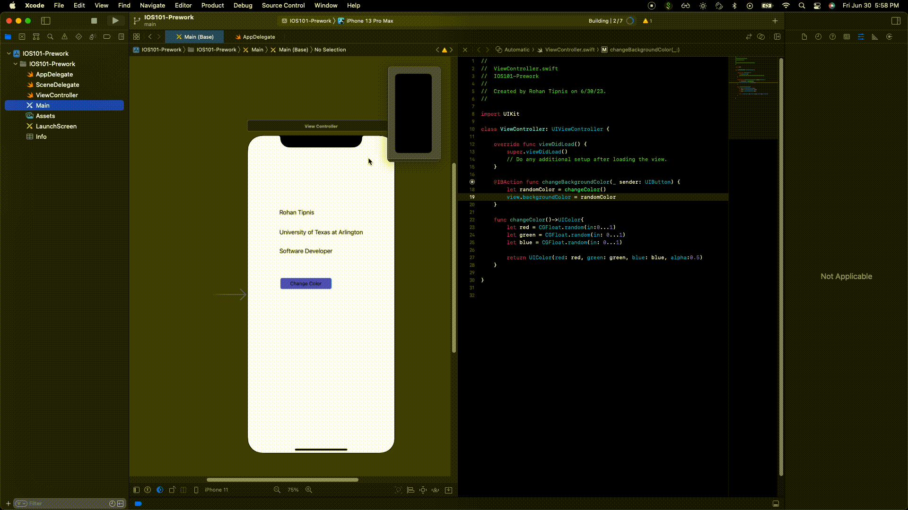

# Prework - **IOS101-Prework**

Submitted by: **Rohan Tipnis**

**IOS101-Prework** is an app that shows a few static labels and allows user to change the background color of the screen to a random color on press of a button.

Time spent: 1.5 hours spent in total

## Required Features

The following **required** functionality is completed:

- [X] Users are able to see a screen with three labels and a button
- [X] Tapping the button changes the screen color to a random color
 
## Video Walkthrough

Here's a walkthrough of implemented user stories:

<!-- Replace this with whatever GIF tool you used! -->
GIF created with [Kap](https://getkap.co/) for macOS  
<!-- Recommended tools:
[Kap](https://getkap.co/) for macOS
[ScreenToGif](https://www.screentogif.com/) for Windows
[peek](https://github.com/phw/peek) for Linux. -->

## App Brainstorming (Step 4)
App - Splitwise
- Adding new expenses
- Displaying expenses based on filters (Date,Users)
- Ability to automatically split the expense among selected users

App - Youtube
- Ability to play videos inside the app
- The picture in picture feature that lets me watch a video as well as do something else in the background

App - Instagram
- Feature to follow or unfollow someone and how it affects the content I see on my feed.
- Ability to direct message someone.
- Sharing a post I find on my feed with someone else through a direct message.

## Notes

## License

    Copyright [yyyy] [name of copyright owner]

    Licensed under the Apache License, Version 2.0 (the "License");
    you may not use this file except in compliance with the License.
    You may obtain a copy of the License at

        http://www.apache.org/licenses/LICENSE-2.0

    Unless required by applicable law or agreed to in writing, software
    distributed under the License is distributed on an "AS IS" BASIS,
    WITHOUT WARRANTIES OR CONDITIONS OF ANY KIND, either express or implied.
    See the License for the specific language governing permissions and
    limitations under the License.
